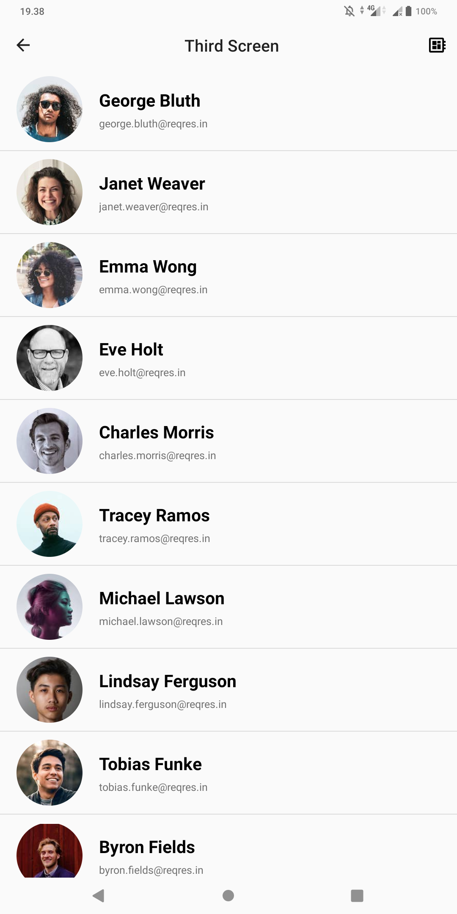

# Mobile-App-Development-Test
## This is for test part 1 of signing in suitmedia

### FirstScreen
a. It has two inputTexts and two buttons. 
b. One inputText for name input and the other for input sentence text, to check whether the sentence is palindrome or not.
    Example :
    e.g isPalindrome(“kasur rusak”) -> true
    e.g isPalindrome(“step on no pets”) -> true
    e.g isPalindrome(“put it up”) -> true
    e.g isPalindrome(“suitmedia”) -> false
c. A button with a “Check” title below the inputTexts
d. Show as dialog with message “isPalindrome” if it’s palindrome and message “not   palindrome” if it’s not palindrome when clicking the button check.
e. And a button with a “Next” title below the Check Button.
f. Go to the Second Screen when clicking the Next button

### SecondScreen
a. It has a static “Welcome” text label/textview
b. And it has two dynamic labels / textviews for the show name from the first screen and the other one is the Selected User Name label.
c. It has a button “Choose a User”.
d. Action click button “Choose a User” for goto third screen.

### ThirdScreen
a. It has a List / Table view of Users
b. Collect data from api from regres.in with email, first_name, last_name & avatar
c. Add a pull to refresh and load the next page when scrolling to the bottom of the list, and prepare an empty state if data is empty. You can use the API with adding parameter page & per_page to get next page data.
d. When a User on an item list is clicked, the Selected User Name label in “Second Screen” will be replaced by the selected User’s name (don’t create a new screen, just continue the current screen).

